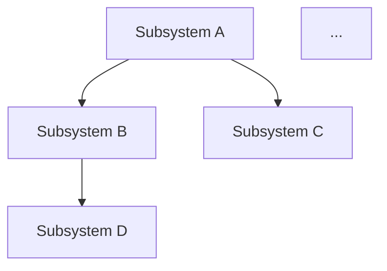

# Architect New — Greenfield Architecture Draft

One of the four `/architect` sub-skills (per [[F084 — Architect redesign]]).

`/architect new` produces a **greenfield draft** — a fresh architecture proposal generated from the project's feature docs and PRD alone, with no anchoring bias from existing architecture, module docs, or source code. The output is a dated draft in `Versions/`. It does NOT update the live `Architecture.md`; integration is the job of `/architect update`.

## When to use

- Starting an anchor that has no architecture yet — `/architect new` is the first step.
- Doing a deliberate "what would we design if we started fresh?" exercise on an anchor whose existing architecture feels stale or misshapen.
- Sanity-checking a major redesign — generate a greenfield draft, compare to live, see which differences are improvements vs. losses of valuable structure.

If the user wants to evolve the existing architecture incrementally, use `/architect update` instead. If the user wants to compare the architecture to current code, use `/architect drift`.

## Anti-anchoring constraint — best-effort

The whole point of this sub-skill is to produce a draft uncontaminated by the existing architecture. Concretely:

- **Do NOT read** `{anchor}/Docs/User/Architecture/Architecture.md` (the live arch).
- **Do NOT read** module docs under `{anchor}/Dev/` (those reflect current implementation).
- **Do NOT read** source code under the `.anchor` `code:` path.
- **Do read** feature docs (`{NAME} Docs/{NAME} Plan/{NAME} Features/F*.md`), the anchor PRD (`{NAME} Docs/{NAME} Plan/{NAME} PRD.md` if present), the backlog (`{NAME} Backlog.md`) for active scope, and any vision / system-design docs in `{NAME} Docs/{NAME} Plan/`.

The constraint is **best-effort, not pristine** (per F084 Resolved § Anti-anchoring constraint is best-effort, not pristine). The agent may have residual knowledge of existing modules from earlier in the session. That's acceptable for v1; a fully-pristine `/architect pristine` variant (fresh worker with no prior context) is deferred until measurement shows it's worth the orchestration cost.

When in doubt during a generation, lean toward what the features+PRD *imply* rather than what the existing code *does*. Disagreement between the two is exactly the value `/architect new` provides.

## Workflow

1. **Detect anchor.** Walk up from `cwd` to find `.anchor`. If none, report `architect-new: no anchor found from {cwd}` and stop.

2. **Locate input docs.** Build the input set:
   - Feature docs: `{NAME} Docs/{NAME} Plan/{NAME} Features/F*.md` (every F-doc, current and historical, since features carry intent).
   - PRD: `{NAME} Docs/{NAME} Plan/{NAME} PRD.md` if present.
   - System design / vision: `{NAME} Docs/{NAME} Plan/{NAME} System Design.md`, `{NAME} Vision.md`, or similar.
   - Backlog horizons: `{NAME} Backlog.md` (read `## Active` / `## Ready` / `## Now` / `## Next` only — `## Later` / `## Done` are de-prioritized for greenfield scoping).

   **Skip** the live architecture file, module docs, and source per § Anti-anchoring.

3. **Read the input set.** Use Read on each doc. For large anchors with many features, batch the reads in parallel.

4. **Synthesize the greenfield architecture.** Produce, in the output file:
   - **Principles** — 3-7 architectural commitments inferred from the features + PRD. Each principle is a sentence + a one-line rationale tying it to specific features or PRD lines.
   - **Block diagram** — Mermaid by default (per F084 § Diagram tooling). Subsystems as nodes, dependencies as edges. Keep it readable — if the diagram has >12 nodes, split into a top-level diagram + per-subsystem detail diagrams.
   - **Subsystems** — for each subsystem: short name, one-paragraph purpose, list of modules it would contain. Use the feature docs' subject-area natural groupings as the seed for subsystem boundaries; resist over-splitting.
   - **Key data structures** — the 3-10 most important entities the system manipulates. One sentence per entity describing what it represents and which subsystem owns it.
   - **Key actions / operations** — the 5-15 most important verbs (user-facing CLI commands, top-level API endpoints, central methods). One sentence per action describing trigger + effect.
   - **Module list** — flat list of all proposed modules, organized by subsystem. This is the seed for module-doc creation later.

5. **Determine the output filename.** Date is today (`YYYY-MM-DD`). Filename: `Versions/{YYYY-MM-DD} Architecture (greenfield).md`. If a greenfield file with today's date already exists, append a sequence suffix: `Architecture (greenfield b).md`, `Architecture (greenfield c).md`.

6. **Create the `Versions/` folder if missing.** Mechanical: `mkdir -p {anchor}/Docs/User/Architecture/Versions/`.

7. **Write the draft.** See § Output template.

8. **Glance the file** (per F084 spec — all `/architect` sub-skills glance their output):
   ```bash
   open "{anchor}/Docs/User/Architecture/Versions/{YYYY-MM-DD} Architecture (greenfield).md"
   ```

9. **Print a one-line summary.** Format:
   ```
   architect-new: greenfield draft written → Versions/2026-05-24 Architecture (greenfield).md ({N} subsystems, {M} modules, {K} actions)
   ```

10. **Suggest the next step.** Append: `Run /architect update to integrate this draft into the live Architecture.md.` (Or, if no live architecture exists yet, `Run /architect update — first-time-invocation path will promote this draft to live.`)

## Output template

```markdown
---
date: {YYYY-MM-DD}
kind: architecture-greenfield
anchor: {NAME}
inputs:
  - {N} feature docs
  - PRD: {present | absent}
  - System design: {present | absent}
---

# {NAME} Architecture (greenfield draft)

**Greenfield draft** — generated by `/architect new` from features + PRD, intentionally without reading the live architecture or code. Not yet integrated into the canonical `Architecture.md` — run `/architect update` to integrate.

## Principles

1. **{Principle name}** — {one-sentence statement}. {Why: rationale tying to specific features}.
2. ...

## Block diagram



## Subsystems

### Subsystem A — {Name}

{One-paragraph purpose statement.}

**Modules:**
- `{module-name}` — {one-line purpose}
- ...

### Subsystem B — {Name}

...

## Key data structures

- **`{EntityName}`** ({owning subsystem}) — {one-sentence description}.
- ...

## Key actions

- **`{action-name}`** ({owning subsystem}) — trigger: {what triggers it}. Effect: {what it does}.
- ...

## Module list (flat)

| Module | Subsystem | Purpose |
|---|---|---|
| `{module}` | {subsystem} | {one-line purpose} |
| ... | ... | ... |

## Inputs

Features read: {list of F-numbers and titles}
PRD: {present|absent — path}
System design: {present|absent — path}
Backlog horizons read: Active({N}) / Ready({N}) / Now({N}) / Next({N})

## Notes

{Any agent observations about gaps in the features, tensions between PRD and features, modules that seemed natural but weren't anchored in any feature, etc. Section may be empty.}
```

## Diagram tooling

**Mermaid by default** (per F084 § Diagram tooling — Mermaid is the agent-generated form; user-authored Excalidraw / OmniGraffle / hand-drawn images are preserved verbatim by `/architect update` but `/architect new` doesn't have any existing images to preserve, so output is Mermaid-only).

Choose diagram style based on what the architecture wants to show:
- **Subsystem dependency** — `graph TD` with subsystem nodes + dependency arrows. Default for v1.
- **Data flow** — `graph LR` if the architecture is fundamentally pipeline-shaped.
- **State machine** — `stateDiagram-v2` if the central abstraction is a state machine (rare for top-level architecture).
- **C4 context / container** — supported by Mermaid; use when the system has clear external boundaries (users, external services, third-party APIs).

If a diagram would be illegible at >12 nodes, generate a **top-level** diagram (subsystems only, no internal modules) plus one **per-subsystem detail** diagram (modules within the subsystem). The output template's `## Block diagram` H2 holds the top-level; per-subsystem detail diagrams go inside each `### Subsystem {X}` section.

## Inferring principles from features

This is the part most likely to feel underdetermined. Heuristics that work:

1. **Recurring constraints.** If 5 feature docs mention "single source of truth," that's a principle.
2. **Recurring rejections.** If multiple feature docs say "rejected silent fallback" or "rejected legacy accumulation," those are principles (the user's CLAUDE.md commitments are usually in this category — check for them).
3. **Tension-resolution patterns.** If features repeatedly resolve speed-vs-correctness in favor of correctness, that's a principle.
4. **Naming conventions.** If features consistently use `{NAME} <slug>` naming, that's a structural principle.
5. **Lifecycle conventions.** If features all follow a Designing → Ready → Active → Verify → Done shape, that's a workflow principle.

Aim for 3-7 principles. Fewer than 3 usually means the synthesis didn't dig hard enough; more than 7 usually means principles are getting confused with subsystem descriptions.

## Seeding subsystem boundaries

Subsystems usually emerge from **subject-area clustering of features**, not from technical-layer cuts:

1. **Group features by subject.** A feature about "skill discovery UX" and a feature about "skill version sync" both live in a `skills` subsystem.
2. **Identify cross-cutting features.** A feature that touches several subjects (logging, metrics, config) usually wants its own subsystem.
3. **Look at data ownership.** Two features that both write the same canonical data probably belong in the same subsystem (so that data has one owner).
4. **Resist over-splitting.** First-pass tendency is to make every feature its own subsystem. Aim for 3-7 subsystems for medium anchors; 5-12 for large ones.

If the features genuinely don't cluster, that's a finding worth surfacing in the `## Notes` section — it suggests the anchor lacks a coherent subject area, which is an architectural concern.

## What `/architect new` does NOT do

- **Does not modify `Architecture.md`.** Output is a fresh file in `Versions/`. The live arch is untouched. First-time invocation (no live arch exists) still writes to `Versions/`; promotion-to-live happens in `/architect update`.
- **Does not produce module docs.** The module list is a flat enumeration; per-module docs are generated by other skills (per `[[CAB Module Doc]]`).
- **Does not validate against code.** That's `/architect drift`.
- **Does not auto-merge with existing arch.** That's `/architect update`'s job (and it specifically reads both, then integrates).

## Relationship to other `/architect` sub-skills

- **`/architect update`** — `/architect new` produces the input draft that `/architect update` integrates. The two-step is intentional: `new` proposes; `update` decides what to keep from both old and new.
- **`/architect drift`** — orthogonal. Drift compares live arch to code. Greenfield doesn't read code at all.
- **`/architect changes`** — orthogonal. Changes recomputes the `## Changes since` section of a live arch. Greenfield produces a standalone draft with no prior version to diff against.

**First-time invocation** (no live `Architecture.md` exists yet): `/architect new` produces a greenfield draft as usual. The user then runs `/architect update` to promote it to live (no snapshot step, since nothing to snapshot). After that, the architecture is live and subsequent `/architect update` invocations follow the standard snapshot-and-mutate-live flow.

## Sources

- [[F084 — Architect redesign]] — parent spec defining the four-sub-skill split.
- [[F074 — Architect skill — Architecture as anchor folder with subsystems]] — the original `/architect` design that F084 supersedes.
- [[2026-05-22 Architect Skill Survey]] — survey of ecosystem skills (Arc42 patterns informed greenfield workflow).
- Arc42 architecture template — borrowed: Mermaid C4 visual conventions, greenfield drafting workflow. Rejected: the 12-section template (over-prescribes structure; we prefer subsystem-folder decomposition per F074).
